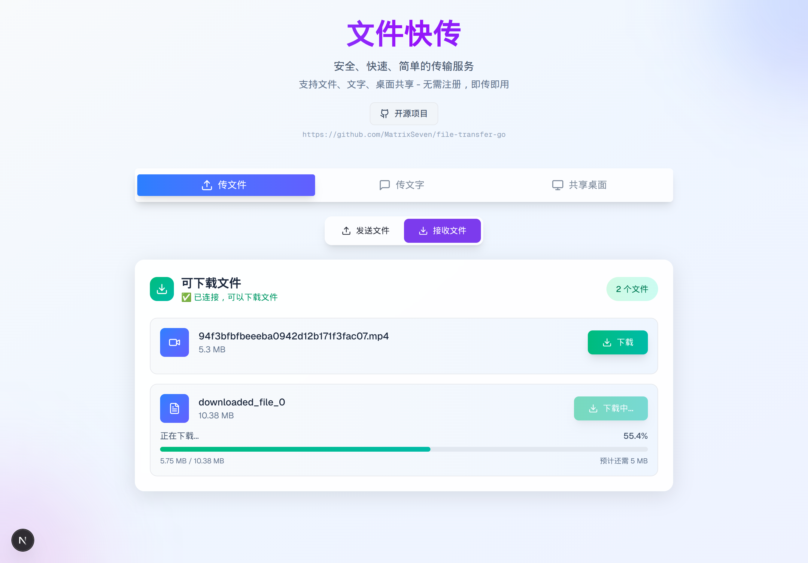

# 文件快传 - P2P文件传输工具


### 在线体验 https://transfer.52python.cn



> 安全、快速、简单的点对点文件传输解决方案 - 无需注册，即传即用


## ✨ 核心功能

- 📁 **文件传输** - 支持多文件同时传输，基于WebRTC的P2P直连
- 📝 **文字传输** - 快速分享文本内容 ✅
- 🖥️ **桌面共享** - 实时屏幕共享 ✅
- 🔗 **连接状态同步** - 实时连接状态UI同步 ✅
- 🔒 **端到端加密** - 数据传输安全，服务器不存储文件
- 📱 **响应式设计** - 完美适配手机、平板、电脑
- 🖥️ **多平台支持** - 支持linux/macos/win 单文件部署

## 🔄 开发进度

- ✅ 文件传输功能
- ✅ 文字传输功能  
- ✅ 桌面共享功能
- ✅ 连接状态UI同步
- 🔄 大文件传输数据安全保证（进行中）
- 🔄 docker镜像发布（进行中）

## 🚀 技术栈

**前端** - Next.js 15 + React 18 + TypeScript + Tailwind CSS  
**后端** - Go + WebSocket + 内存存储  
**传输** - WebRTC DataChannel + P2P直连

## 📦 快速部署

```bash
git clone https://github.com/MatrixSeven/file-transfer-go.git
cd file-transfer-go
./build-fullstack.sh 
./dist/file-transfer-go
```

访问 http://localhost:8080 开始使用

## 🎯 使用方法

**发送文件**
1. 选择文件 → 生成取件码 → 分享6位码

**文字传输**
1. 输入文字内容 → 生成取件码 → 分享给对方

**桌面共享**
1. 点击共享桌面 → 生成取件码 → 对方输入码观看

## 📊 项目架构

```
发送方 ←─── WebSocket信令 ───→ 服务器 ←─── WebSocket信令 ───→ 接收方
   │                                                            │
   └────────────── WebRTC P2P直连传输 ──────────────────────────┘
```

## 🛠️ 本地开发

```bash
# 后端
make dev

# 前端
cd chuan-next && yarn && yarn dev
```

## 📄 许可证

MIT License

---

⭐ 觉得有用请给个星标！
